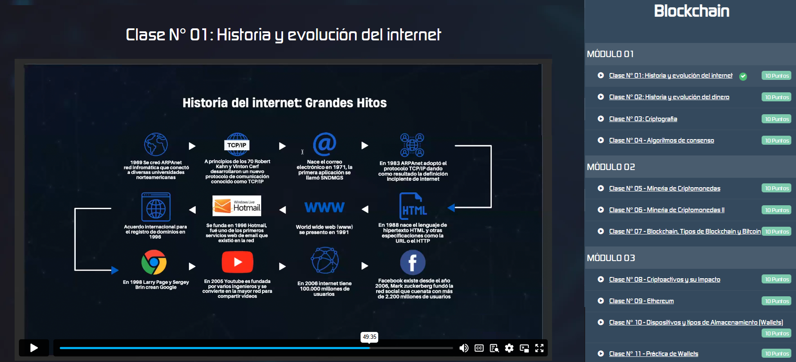

# API para Gestión de Módulos de Cursos

Este es un API RESTful que proporciona información sobre módulos de cursos y sus clases asociadas. El API también utiliza **JWT** para proteger rutas sensibles.

La API está desplegada y disponible en la siguiente URL:

**[https://test-frontend-dev.onrender.com](https://test-frontend-dev.onrender.com)**

## Endpoints

### 1. **Login para obtener JWT**
**Método**: `POST`  
**URL**: `/login`

Este endpoint permite autenticar al usuario y obtener un **JSON Web Token (JWT)** que debe incluirse en las cabeceras de las solicitudes siguientes para acceder a las rutas protegidas.

#### Request Body (JSON):

*json*
{
  "username": "usuario",
  "password": "contraseña"
}

*Response*
{
  "access_token": "your_jwt_token_here"
}

con este token podrás acceder al siguiente endpoint:
**[https://test-frontend-dev.onrender.com/api/modulos](https://test-frontend-dev.onrender.com/api/modulos)**
donde obtendras una respuesta como esta: 

[
  {
    "titulo": "Módulo 1: Introducción al Desarrollo Web",
    "descripcion": "Este módulo cubre los fundamentos del desarrollo web, desde HTML hasta CSS.",
    "clases": [
      {
        "titulo": "Introducción a HTML",
        "video": "https://www.example.com/video_html.mp4",
        "descripcion": "Aprende los fundamentos de HTML.",
        "duracion": "30 minutos",
        "completado": false
      },
      {
        "titulo": "CSS Básico",
        "video": "https://www.example.com/video_css.mp4",
        "descripcion": "Introducción al diseño web con CSS.",
        "duracion": "45 minutos",
        "completado": true
      }
    ]
  }
]
Puedes utilizar Js Vanilla, React o Next para consumir dicha API; en cuanto a tecnolgías derivadas de CSS tienes libre eleccion. 
Usa como referencia el siguiente ejemplo; finalmente tienes libertad de diseño.

Puntos a valorar:
  - Conocimientos en diseño responsivo
  - Conocimientos en UI/UX
  - Calidad de código
  - Rendimiento de componentes
*Esta prueba busca evaluar el expertise del postulante; no necesitas presentarlo en tiempo record. Rindelo con traquilidad y disfruta del Test*
